### LAURA LUQUE BRAVO
## Tarea Git 3.7: Pull Request y Tags de git.

- Debéis haced un pull request en el repositorio del compañero ( este debe añadir contenido al repo ). Y después intercambias los papeles.

    Una vez terminado la anterior y ahora individualmente, cada uno en su repositorio, hace un commit más, a este último commit añadile un tag que se llame "v1.0".

    Después haced un clone del repositorio del tag "v1.0" en el Linux que estamos usando para la práctica.

1. Nos dirigimos al repo de nuestro compañero y copiamos su url para clonar el repo en nuestro PC local y poder trabajar con él:

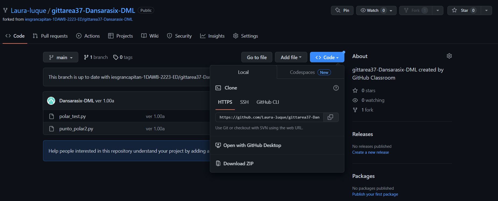

Una vez tenemos el repo copiados, nos vamos a la consola.
Nos dirigimos a la carpeta donde queremos copiar el repo del compañero y hacemos el primer comando.
Una vez copiado el repo, nos dirigimos a la carpeta del repo del compañero, usando el segundo comando, y creamos una rama y nos movemos a ella, usuando el tercer comando:

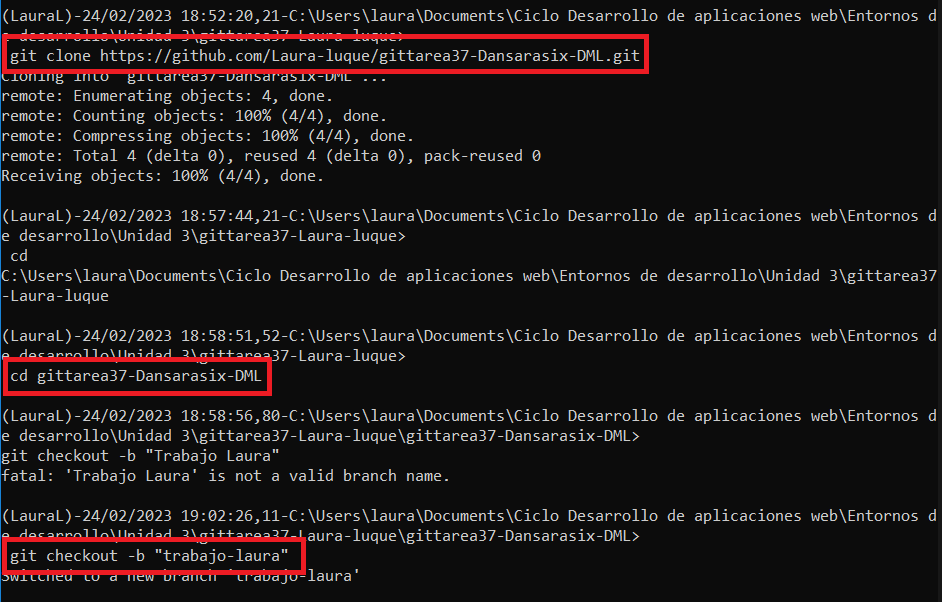

A continuación elegimos una archivo de nuestro del repo de nuestro compañero y hacemos una modificación.
Nos vamos a la consola y hacemos un git status donde podemos ver cual es el archivo que hemos modificado marcado en rojo por la consola.

Vamos ahora a subir estos cambios al repo del compañero mediante los comando que ya conocemos:

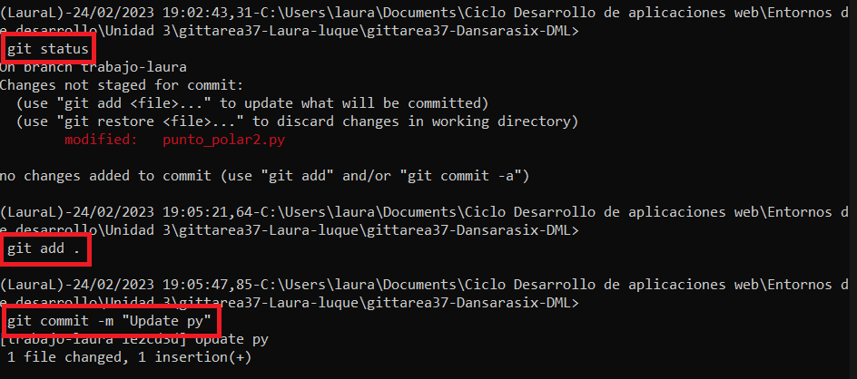
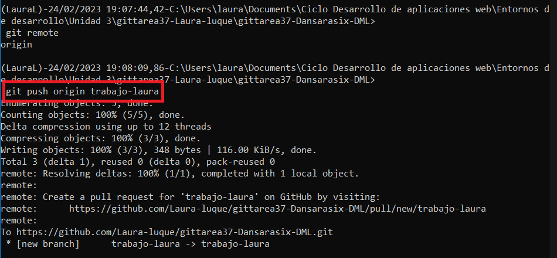

Nos vamos al repo del compañero y nos dirigimos a la pestaña Pull request donde ponemos el nombre del commit con todos los detalles posibles sobre los cambios realizados para que nuestro compañero los conozca.

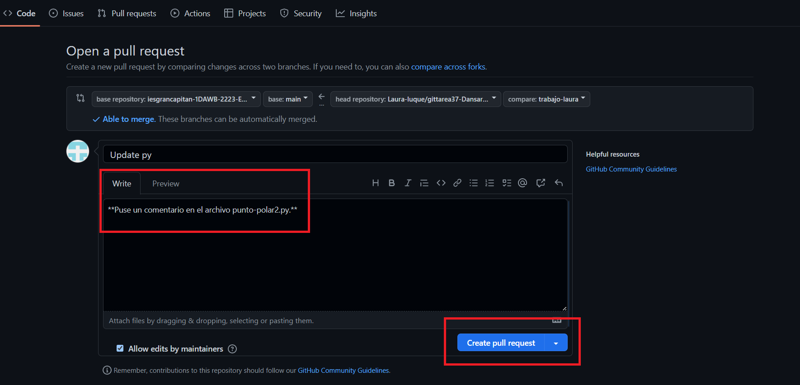

Una vez creada la pull request, esta modificación le llegará a nuestro compañero por email y tambien cuando acceda a su repo.

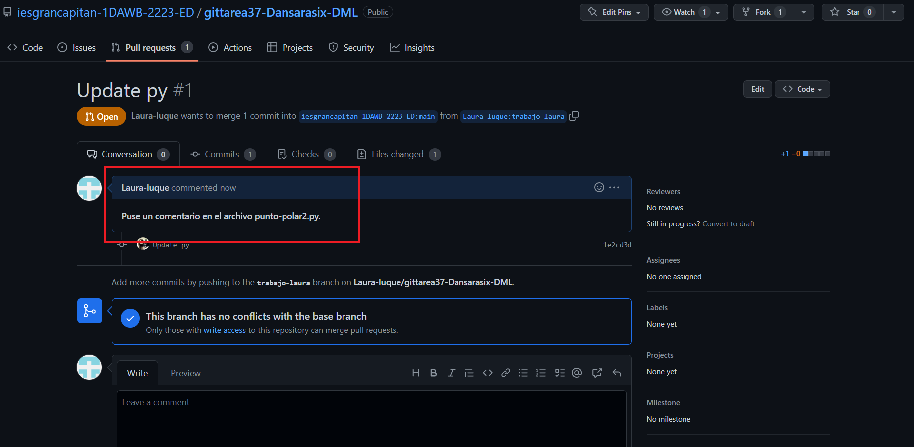

-------------------------

Ahora mi compñaero va a realizar lo mismo pero con un documento  que yo tengo en mi repo. Para ello voy a subir un HTML vacío a mi repo.
Mi compañero realizó modificaciones en mi HTML vacío y al entrar en mi repo me aparecío que mi compañero hizo un cambios en el archivo index.html y el botón Merge pull request, así aceptamos los cambios que él ha realizado.

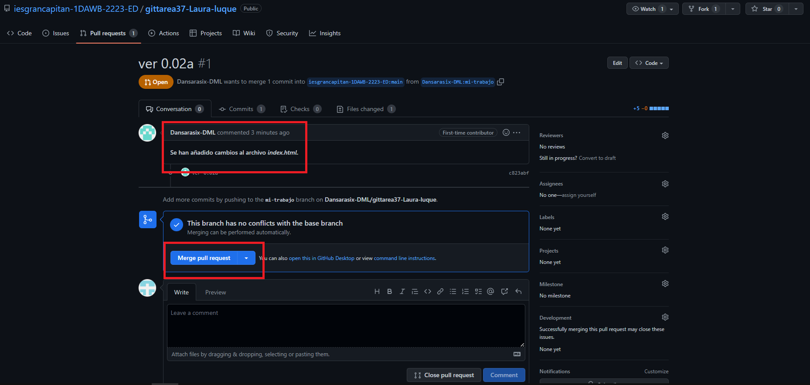

También, como nos pide la prácitca, voy a crearle a este último commit un tag llamado v1.0.

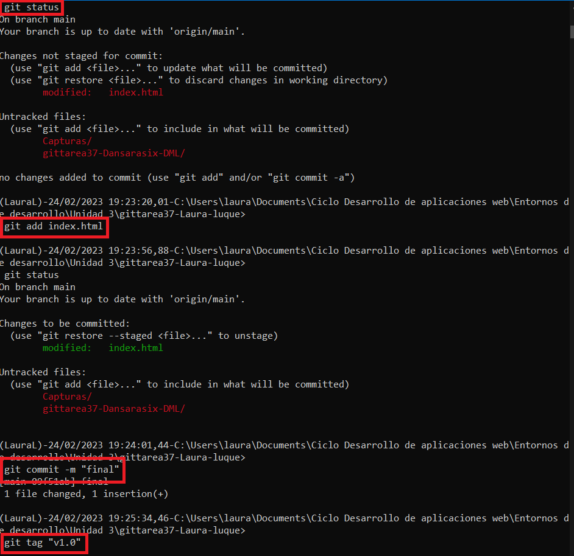

Una vez añadido comprobamos que se ha añadido correctamente con el comando primero y luego lo subimos a nuestro repo:

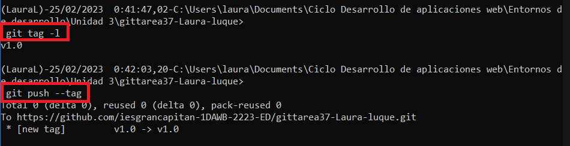

Como nos lo pide en la práctica, vamos a hacer un clone del repo de que contiene el tag, asi que me dirijo a abrir la máquina virtual y en la consola de Windows la conecto con la máquina virtual con el comando ssh que ya hemos usado en otras prácticas:

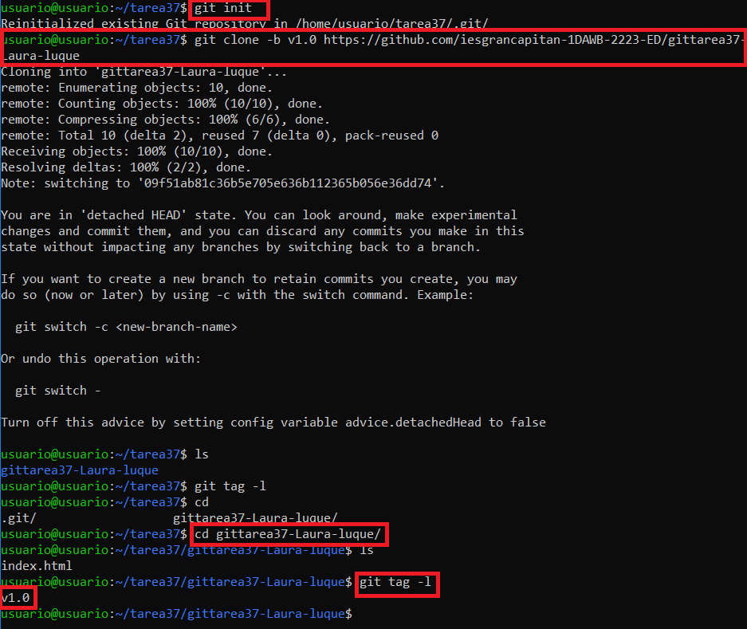

Como se puede ver en los últimos comandos si nos dirigimos a la carpeta de mi repo y hacemos un listado, nos aparece nuestro HTML y si hacemos un listado de los tag que tenemos nos aparece el tag que añadimos en nuestro repo local.
DEjo tambien la captura de esto mismo pero en la consola de la máquina virtual de Linux:

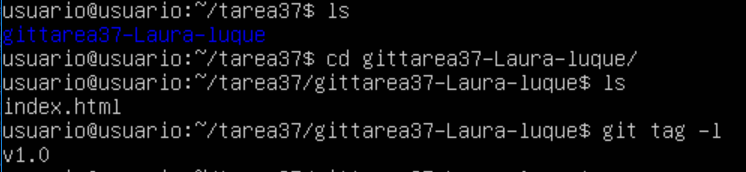